# Flujos Visuales del Sistema de Gestión Automatizado IZT (LEPA-LEM)

Este documento organiza y describe las capturas de pantalla del prototipo visual del sistema, estructuradas por flujos de trabajo funcionales.

---

## 1. Configuración Inicial e Inicio de Sesión
Este flujo abarca desde la autenticación del usuario hasta la configuración inicial del laboratorio asignado a la máquina.

### Iniciar Sesión
Pantalla básica de autenticación para ingresar al sistema local.

### Configuración Inicial - Paso 1
Selección del laboratorio físico (LEPA o LEM) que operará en la máquina local.

### Configuración Inicial - Paso 2
Configuración técnica de credenciales y conexión del servidor local.

### Configuración Inicial - Confirmación (Paso 2.1)
Verificación del laboratorio activo en el sistema.
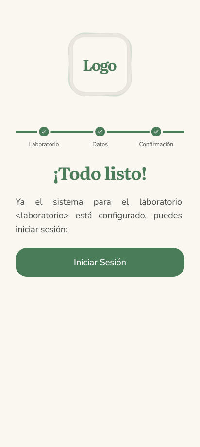

---

## 2. Panel Principal (Dashboard)
El panel principal consolida accesos rápidos, alertas críticas y estadísticas básicas del laboratorio.

### Dashboard General
Vista inicial después de iniciar sesión, con el laboratorio activo destacado en el encabezado.
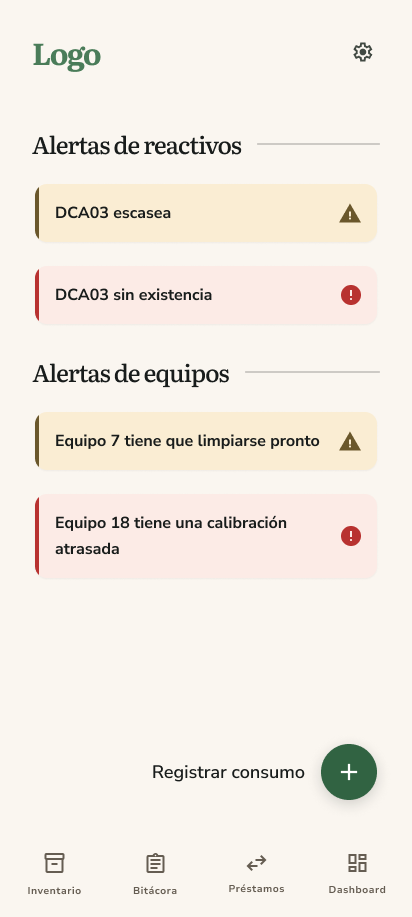

---

## 3. Gestión de Inventario
Flujo para la navegación por los diferentes tipos de inventario y consulta del catálogo de reactivos.

### Menú de Selección de Inventario
Pantalla de selección del inventario a consultar (Reactivos, Vidriería, Equipos).
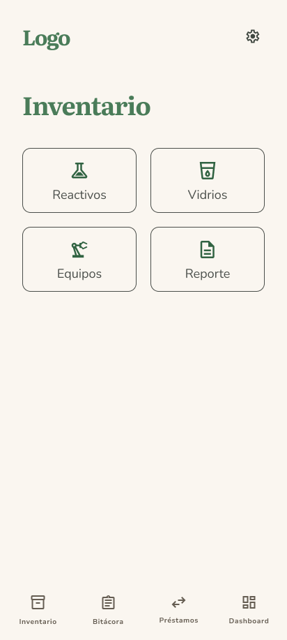

### Catálogo de Existencias de Reactivos
Vista detallada con la lista de reactivos químicos, stock actual, alertas de umbral mínimo y búsqueda.
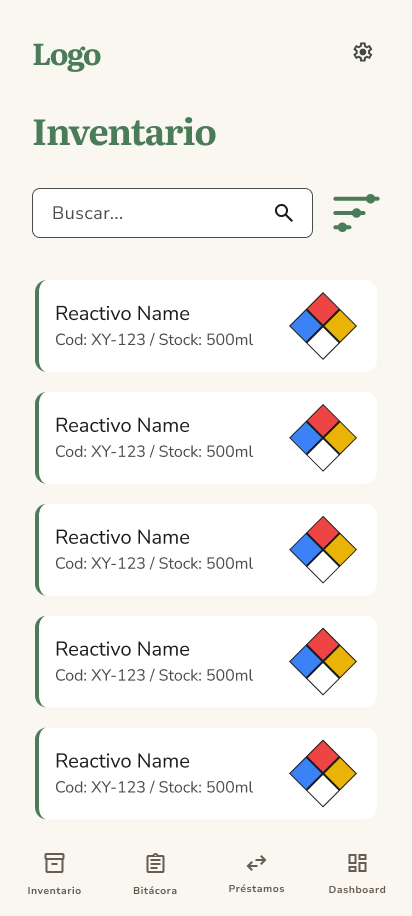

### Detalle de Lotes y Ubicación de Reactivo
Ficha informativa de un reactivo con desglose de ubicación física, cantidad y fechas de vencimiento.
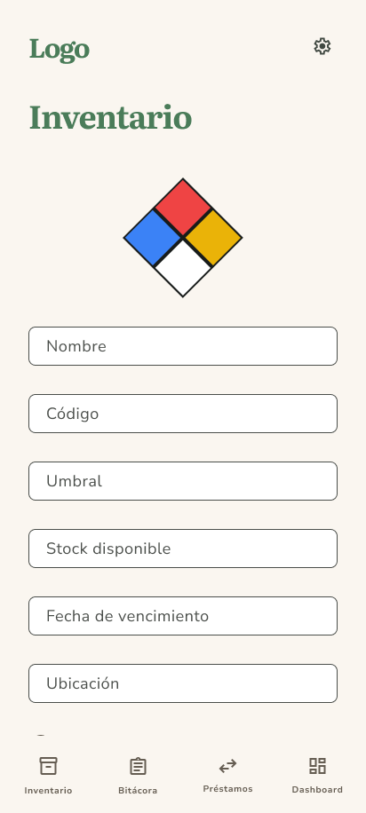

---

## 4. Consumo de Reactivos
Flujo para registrar la salida o el uso de reactivos del inventario físico.

### Registro de Consumo
Formulario para ingresar el reactivo, cantidad consumida, usuario responsable y observaciones.
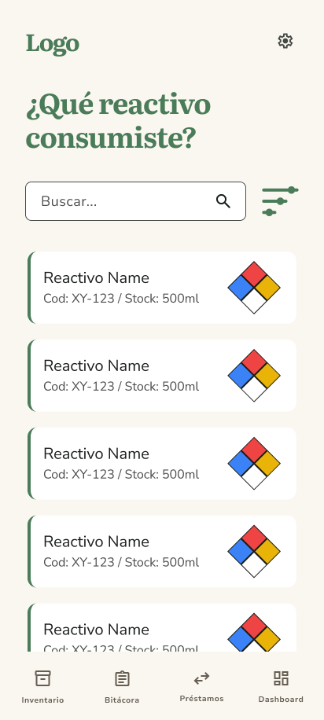

### Detalle y Trazabilidad del Consumo
Visualización del movimiento de consumo registrado y su impacto en el inventario.
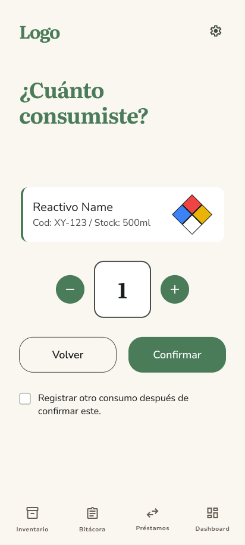

---

## 5. Préstamos Inter-Laboratorios
Flujo para registrar el envío y recepción de préstamos de reactivos químicos entre LEPA y LEM.

### Bandeja de Préstamos
Historial de solicitudes de préstamos salientes y entrantes con su estado correspondiente.
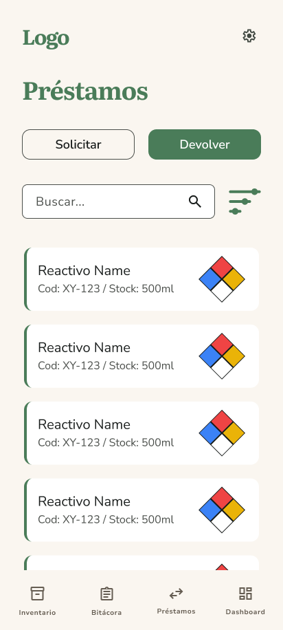

### Registro de Préstamo (Origen)
Detalle del préstamo saliente y envío del reactivo al laboratorio destino.

### Recepción del Préstamo (Destino)
Confirmación del ingreso físico del reactivo en el inventario del laboratorio receptor.
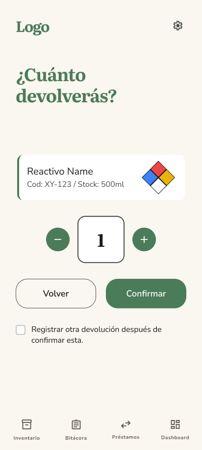

---

## 6. Bitácora de Movimientos e Historial
Registro cronológico inmutable de todas las acciones del sistema para fines de auditoría.

### Bitácora General
Listado cronológico de todos los movimientos de inventario.
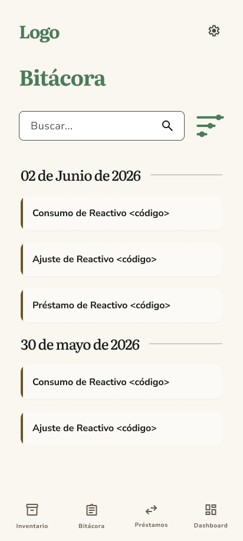

### Historial de Consumos
Filtro de bitácora enfocado únicamente en la salida por consumo de reactivos.
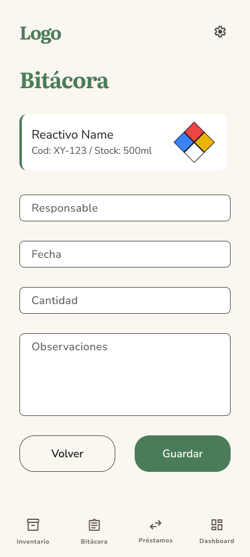

### Historial de Préstamos
Filtro de bitácora enfocado en transferencias entre laboratorios.
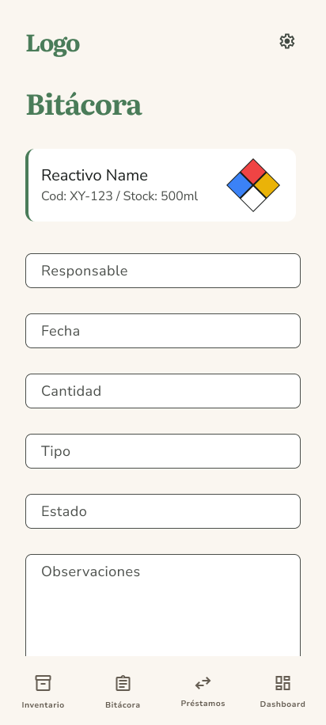

### Historial de Ajustes
Filtro de bitácora enfocado en modificaciones o correcciones manuales de stock.
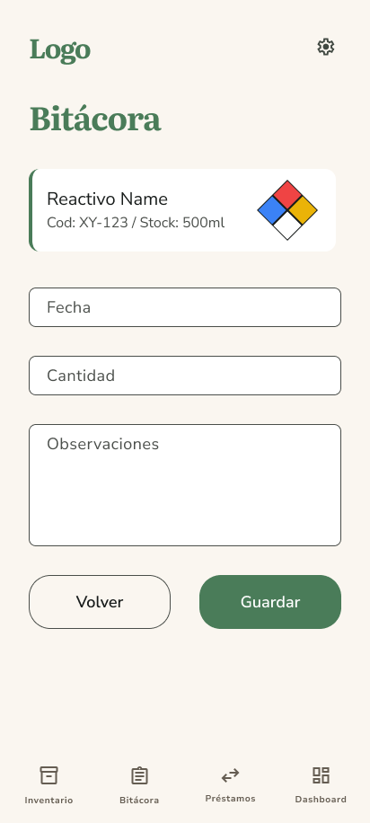
