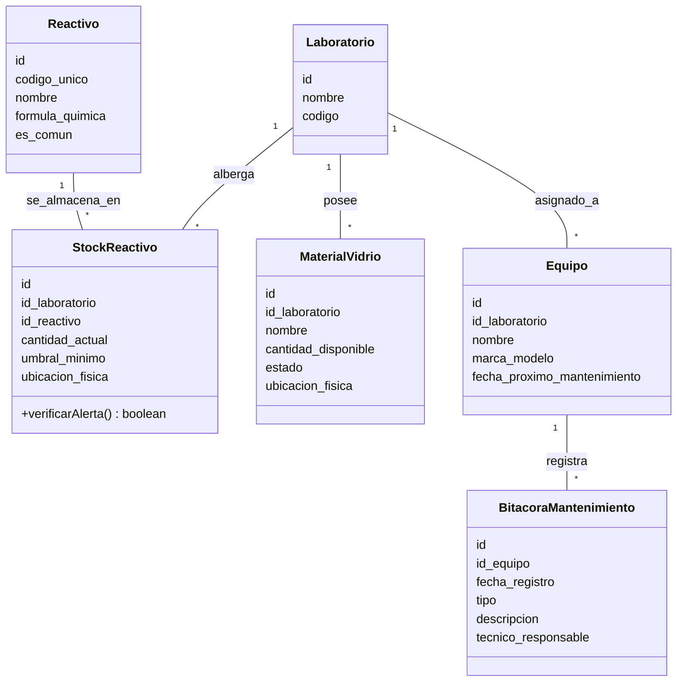

```mermaid
classDiagram
    class Laboratorio {
        id
        nombre
        codigo
    }

    class Reactivo {
        id
        codigo_unico
        nombre
        formula_quimica
        es_comun
    }

    class StockReactivo {
        id
        id_laboratorio
        id_reactivo
        cantidad_actual
        umbral_minimo
        ubicacion_fisica
        +verificarAlerta() boolean
    }

    class MaterialVidrio {
        id
        id_laboratorio
        nombre
        cantidad_disponible
        estado
        ubicacion_fisica
    }

    class Equipo {
        id
        id_laboratorio
        nombre
        marca_modelo
        fecha_proximo_mantenimiento
    }

    class BitacoraMantenimiento {
        id
        id_equipo
        fecha_registro
        tipo
        descripcion
        tecnico_responsable
    }

    %% Relaciones y Multiplicidad
    Laboratorio "1" -- "*" StockReactivo : alberga
    Reactivo "1" -- "*" StockReactivo : se_almacena_en
    
    Laboratorio "1" -- "*" MaterialVidrio : posee
    
    Laboratorio "1" -- "*" Equipo : asignado_a
    Equipo "1" -- "*" BitacoraMantenimiento : registra
```
